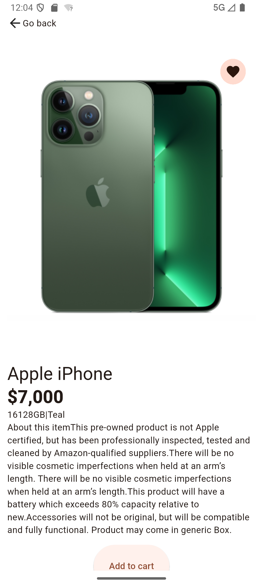
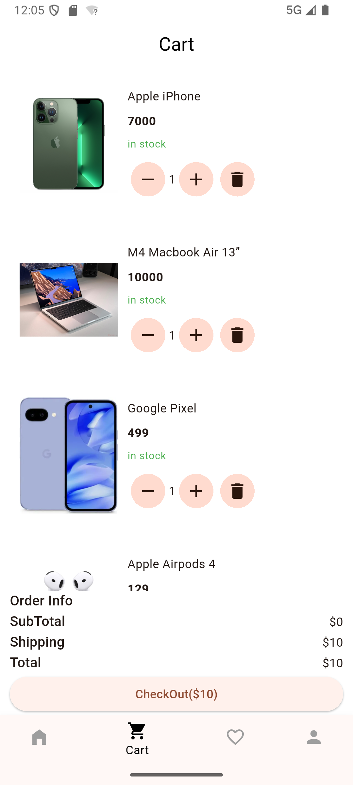

# 🛍️ MiniMart – eCommerce

This project is a three-screen eCommerce mobile application developed based on a provided Figma design. The goal of the assessment is to demonstrate precision in UI implementation, proper navigation, effective state management and well-structured Flutter component architecture.

## 📱 Screens Implemented

1. **Home Screen** – Displays product listings using sample data.
2. **Product Details Screen** – Shows selected product details.
3. **Cart Screen** – Displays items added to the cart with quantities and total price.


## 🚀 Tech Stack

- **Flutter** (latest stable version)
- **Dart** (latest stable version)
- **State Management**: `Stack` && `Provider` 
- **Navigation**: Flutter’s built-in `Navigator`
- **Fonts & Icons**: Integrated based on Figma specs using Google fonts

## 🧪 Features

- Responsive and pixel-perfect UI matching the Figma design
- Modular and reusable widgets
- Smooth navigation across screens

## 🖼️ Screenshots

| Home Screen | Product Details | Cart Screen |
|-------------|-----------------|-------------|
|  |  |  |

## 🛠️ Getting Started

### Prerequisites

- Flutter SDK installed
- Dart SDK installed
- Android Studio or VS Code (recommended)
- Android/iOS emulator or physical device

### Setup Instructions

```bash
# 1. Clone the repository
git clone https://github.com/Heebu/mini_mart.git
cd mini_mart

# 2. Get dependencies
flutter pub get

# 3. Run the app
flutter run 
```

### Folder Structure

lib/
├── main.dart
├── splash.dart
├── data/
├── models/
├── view
    ├── widgets/ 
    └── home/
        ├── home.dart
        ├── home_viewmodel.dart
        ├── favorite_page/
        ├── home_page/
        ├── product_page/
        ├── profile_page/
        └── cart_page/
│   
└── utils/


### 🙌 Author

    Idris Adedeji - 'Heebu Prime'
    GitHub: @heebu
